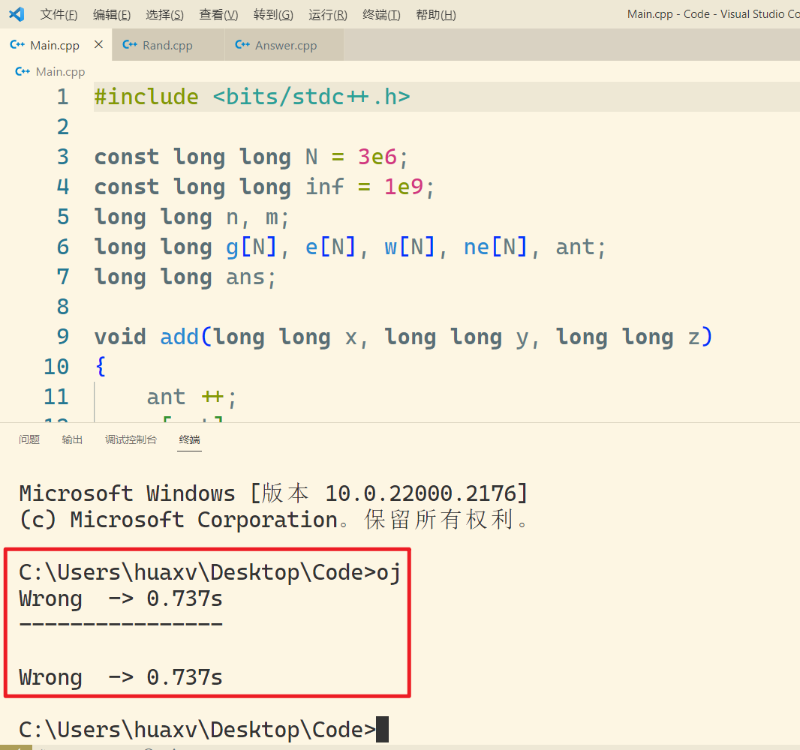
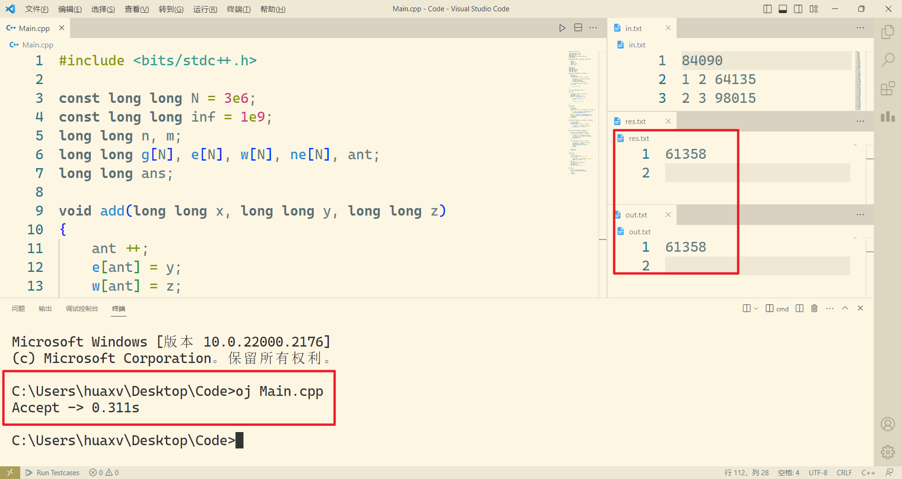
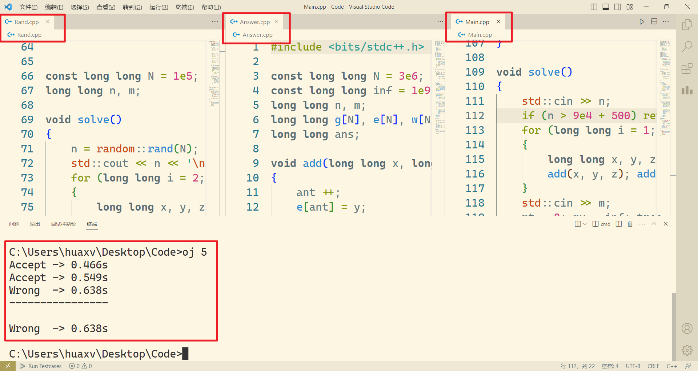
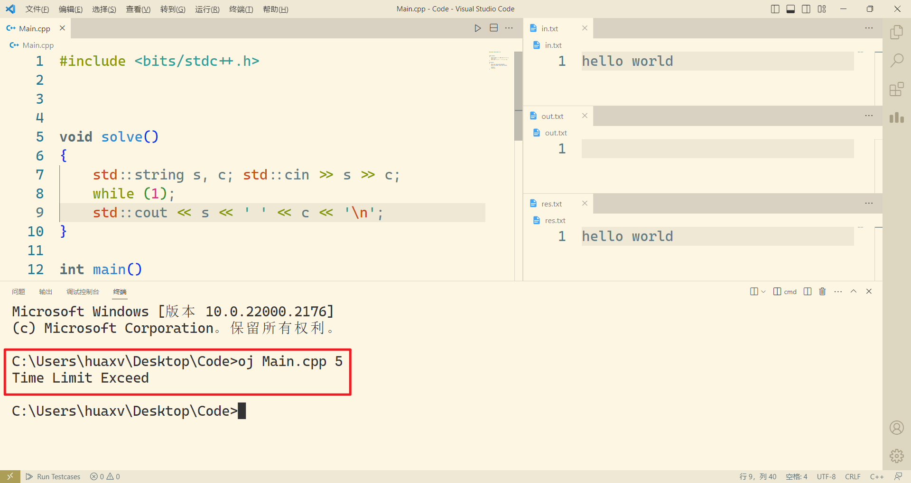
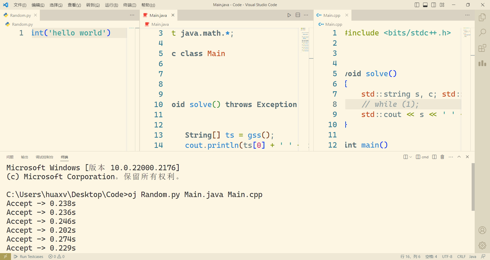
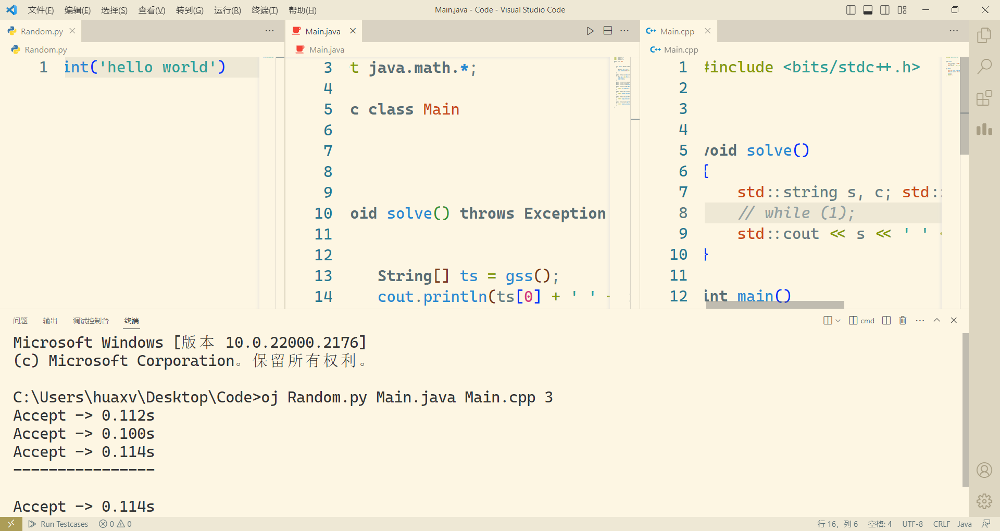
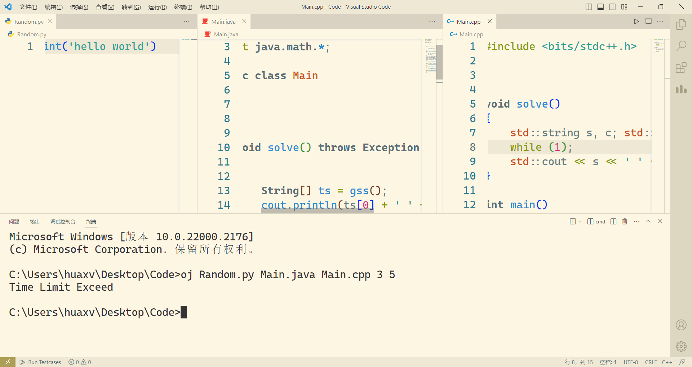

# OJ 对拍

## 前置要求

- 必须支持 `c++20`
- 必须有 `python3`
- 必须有 `java`
- 必须将 `tools.py` 和 `oj.bat` 所在的目录加入环境变量中

## 使用

### 命令 1：`oj`

在命令行中输入 `oj` 会默认对拍 $10$ 次，并且必须实现 `Rand.cpp` 和 `Answer.cpp` 和 `Main.cpp` 三个文件才能实现对拍

用 `Rand.cpp` 随机生成数据点，接着用 `Answer.cpp` 生成答案，然后用 `Main.cpp` 的结果与 `Answer.cpp` 的答案做比较

如果答案相同：`Accept -> use_time`

如果答案错误：`Wrong  -> use_time`

如果运行超过 $10$ 秒：`Time Limit Exceed`



### 命令 2：`oj 文件名.cpp`

将会用 `in.txt` 作为输入 `res.txt` 作为答案 `out.txt` 作为输出，执行 `文件名.cpp` 程序

并判断 `res.txt` 与 `out.txt` 的内容是否相同，不相同就是 `Wrong`，相同就是 `Accept`，超时就是 `TLE`



### 命令 3：`oj 文件名.c`

运行 `.c` 文件与，与命令 2 差不多逻辑

### 命令 4：`oj 文件名.py`

运行 `.py` 文件与，与命令 2 差不多逻辑

### 命令 5：`oj 文件名.java`

运行 `.java` 文件与，与命令 2 差不多逻辑

### 命令 6：`oj 数字`

例如 `oj 100` 表示对拍 `Rand.cpp`、`Answer.cpp`、`Main.cpp` $100$ 次



### 命令 7：`oj 文件名.后缀名 数字`

例如 `oj Demo.cpp 5` 表示限时 $5$ 秒运行 `Demo.cpp` 文件，当然以 `in.txt` 作为读入，`res.txt` 作为答案，`out.txt` 作为输出



### 命令 8：`oj 文件1 文件2 文件3 数字`

例如 `oj Random.py Answer.java Main.cpp 100`

表示用 `Random.py` 生成随机测试点，用 `Answer.java` 生成答案，测试 `Main.cpp` 程序是否正确，并且测试 $100$ 次





### 命令 9：`oj 文件1 文件2 文件3 数字 数字`

例如 `oj Random.py Answer.java Main.cpp 100 5`

表示用 `Random.py` 生成随机测试点，用 `Answer.java` 生成答案，测试 `Main.cpp` 程序是否正确，并且测试 $100$ 次，并且每一个测试都限时 $5$ 秒，超出时间表示超时！



## 源码

**tools.py**

```py
import random
import sys
import os
import shutil
import time
from multiprocessing import Process
import multiprocessing
from multiprocessing import Pool
from concurrent.futures import ThreadPoolExecutor,wait,ALL_COMPLETED,FIRST_COMPLETED, as_completed
# import concurrent.futures
# import subprocess
import threading

# 将一行字符串按空格切割
def split(s):
    res = ""
    space = {' ', '\t', '\n', '\r', '\f'}
    ans = []
    for i in s:
        if i in space: 
            if len(res) > 0:
                ans.append(res)
                res = ""
            continue
        res += i
    return res


# 返回命令行参数
def args():
    return sys.argv[1:]

# 读取一个字符串
def next(f):
    res = ''
    space = {' ', '\t', '\n', '\r', '\f'}
    c = f.read(1)
    while c: 
        if (c in space) and len(res):
            return res
        if c not in space:
            res += c
        c = f.read(1)
    return res

# 判断两个文件是否相同
def equals(file1, file2):
    with open(file1, mode='r', encoding='utf-8') as f1, \
        open(file2, mode='r', encoding='utf-8') as f2:
        s1 = next(f1)
        s2 = next(f2)
        while s1 and s2:
            if s1 != s2 :
                return False
            s1 = next(f1)
            s2 = next(f2)
        return not s1 and not s2

# 初始化工作区目录
def init():
    try:
        os.system('if not exist in.txt type nul> in.txt')
        os.system('type nul> out.txt')
        os.system('if not exist res.txt type nul> res.txt')
        os.mkdir('.check')
    except:
        shutil.rmtree('.check')
        os.mkdir('.check')
    # os.system('type nul> .check\\time.txt')
    
def run_func(func, args, qu):
    st = time.time()
    func(*args)
    ed = time.time()
    qu.put(ed - st)

# 统计函数运行耗时，可以限制最长时间
def spand(fun, cmds, ti = -1):
    p = Process(target=fun, args=(*cmds, ))
    p.start()
    pid = p.pid
    # print(p.pid())
    st = time.time()
    while True:
        nw = time.time()
        if not p.is_alive():
            # print('%.3fs' % (nw - st, ), ti)
            return nw - st
        if ti > -1 and nw - st > ti:
            os.system(f'taskkill /f /t /pid {pid} >nul')
            return -1
        
def language(name):
    if name.endswith('.c'): return 'c'
    if name.endswith('.cpp'): return 'cpp'
    if name.endswith('.py'): return 'py'
    if name.endswith('.java'): return 'java'
    return None

def fcopy(name1, name2):
    os.system(f'copy /y {name1} {name2} >nul')

def compiler(name):
    fcopy(name, f'.check\\{name}')
    lg = language(name)
    cmd = ''
    if lg == 'c':
        cmd = f'gcc -w -std=c99 -static .check\\{name} -o .check\\{name[:-2]} -O2 -Wall -Wextra -Wl,--stack=549453824'
    elif lg == 'cpp':
        cmd = f'g++ -w -std=c++20 -static -O2 -Wall -Wextra -Wl,--stack=549453824 .check\\{name} -o .check\\{name[:-4]}'
    elif lg == 'java':
        cmd = f'javac -encoding utf8 .check\\{name}'
    if cmd:
        os.system(cmd)

def run_single(name, ti):
    ti = int(ti)
    qu = multiprocessing.Queue()
    compiler(name)
    lg = language(name)
    qu = multiprocessing.Queue()
    t = None
    if lg == 'c':
        t = spand(run_func, (os.system, (f'.check\\{name[:-2]} <in.txt >out.txt', ), qu), ti)
    elif lg == 'cpp':
        t = spand(run_func, (os.system, (f'.check\\{name[:-4]} <in.txt >out.txt', ), qu), ti)
    elif lg == 'java':
        t = spand(run_func, (os.system, (f'java -cp .check {name[:-5]} <in.txt >out.txt', ), qu), ti)
    else:
        t = spand(run_func, (os.system, (f'python -u .check\\{name} <in.txt >out.txt', ), qu), ti)
    if t == -1:
        print("Time Limit Exceed")
    else:
        if equals('out.txt', 'res.txt'):
            print("Accept -> %.3fs" % qu.get())
        else:
            print("Wrong  -> %.3fs" % qu.get())

def ck_compiler(f1, f2, f3):
    pool = Pool(3)
    pool.apply_async(compiler, (f1, ))
    pool.apply_async(compiler, (f2, ))
    pool.apply_async(compiler, (f3, ))
    pool.close()
    pool.join()

    
def ck_get_run(f):
    lg = language(f)
    if lg == 'c':
        return f'.check\\{f[:-2]}'
    elif lg == 'cpp':
        return f'.check\\{f[:-4]}'
    elif lg == 'java':
        return f'java -cp .check {f[:-5]}'
    else :
        return f'python -u .check\\{f}'

status = 0
rt = []
op = 0
lock = threading.Lock()

def ck_run_and_check(id, f1, f2, f3, ti):
    global status
    global rt
    global op
    if status:
        return
    a = ck_get_run(f1)
    b = ck_get_run(f2)
    c = ck_get_run(f3)
    a += f" >.check\\in_{id}.txt"
    b += f" <.check\\in_{id}.txt >.check\\res_{id}.txt"
    c += f" <.check\\in_{id}.txt >.check\\out_{id}.txt"
    os.system(f'type nul> .check\\in_{id}.txt')
    os.system(f'type nul> .check\\out_{id}.txt')
    os.system(f'type nul> .check\\res_{id}.txt')
    qu = multiprocessing.Queue()
    t = spand(run_func, (os.system, (a, ), qu), 10)
    with lock:
        if status: return
        if t == -1:
            print('Rand Time Limit Exceed')
            status = 3
            return
    t = spand(run_func, (os.system, (b, ), qu), 10)
    with lock:
        if status: return
        if t == -1:
            print('Answer Time Limit Exceed')
            status = 4
            return
    t = spand(run_func, (os.system, (c, ), qu), ti)
    if t == -1:
        with lock:
            if status: return
            status = 2
        return
    if equals(f'.check\\out_{id}.txt', f'.check\\res_{id}.txt'):
        t = qu.get()
        with lock:
            if status: return
            print("Accept -> %.3fs" % t)
            rt.append(t)
    else:
        t = qu.get()
        with lock:
            if status: return
            status = 1
            print("Wrong  -> %.3fs" % t)
            rt.append(t)
            fcopy(f'.check\\in_{id}.txt', 'in.txt')
            fcopy(f'.check\\out_{id}.txt', 'out.txt')
            fcopy(f'.check\\res_{id}.txt', 'res.txt')
    os.remove(f'.check\\in_{id}.txt')
    os.remove(f'.check\\out_{id}.txt')
    os.remove(f'.check\\res_{id}.txt')
    
def check(f1 = "Rand.cpp", f2 = "Answer.cpp", f3 = "Main.cpp", ti = -1, ts = 10):
    ti = int(ti)
    ts = int(ts)
    ck_compiler(f1, f2, f3)
    
    all_task = []
    with ThreadPoolExecutor(max_workers=5) as pool:
        for i in range(1, ts + 1):
            all_task.append(pool.submit(lambda p: ck_run_and_check(*p), (i, f1, f2, f3, ti)))
        wait(all_task, return_when=ALL_COMPLETED)
    
    # print(rt)
    # print(status)
    
    if status == 2:
        print("Time Limit Exceed")
        return
    
    elif status == 1:
        print("----------------\n")
        print("Wrong  -> %.3fs" % max(rt))
    elif status == 0:
        print("----------------\n")
        print("Accept -> %.3fs" % max(rt))
        

if __name__ == '__main__':
    init()
    
    sls = args()
    n = len(sls)
    if n == 0:
        check(ti=10)
    elif n == 1:
        t = language(sls[0])
        if t:
            run_single(sls[0], 10)
        else:
            check(ti=10, ts=int(sls[0]))
    elif n == 2:
        run_single(sls[0], int(sls[1]))
    elif n == 3:
        check(*sls)
    elif n == 4:
        check(sls[0], sls[1], sls[2], ts=int(sls[3]))
    elif n == 5:
        check(sls[0], sls[1], sls[2], ts=int(sls[3]), ti=int(sls[4]))
```

**oj.bat**

```shell
@echo off

copy %~dp0tools.py tools.py > nul && python -u tools.py %*

```

## 推荐使用随机函数

```c++
namespace random
{
    std::random_device rd;
    std::mt19937 mt(rd());
    unsigned int sb = mt();
    unsigned int si = mt();
    unsigned long long sl = mt();

    bool rbool()
    {
        sb ^= sb << 13;
        sb ^= sb >> 17;
        sb ^= sb << 5;
        return sb & 1;
    }

    unsigned int rint()
    {
        si ^= si << 13;
        si ^= si >> 17;
        si ^= si << 5;
        return si;
    }

    unsigned long long rlong()
    {
        sl ^= sl >> 12;
        sl ^= sl << 25;
        sl ^= sl >> 27;
        return sl;
    }

    // 1 ~ n
    long long rand(long long n)
    {
        if (n <= 1) return n;
        long long len = n + (n & 1);
        long long mid = len >> 1;
        bool opt = rbool();
        if (opt) return rand(mid);
        else
        {
            long long t = mid + rand(mid);
            if (t > n) return rand(n);
            return t;
        }
    }

    template<typename T>
    void rlist(std::vector<T>& nums)
    {
        long long n = nums.size();
        for (long long i = n - 1; i; i --)
        {
            long long p = rand(i + 1) - 1;
            T t = nums[p];
            nums[p] = nums[i];
            nums[i] = t;
        }
    }
};

```

## 打包下载

[]()
