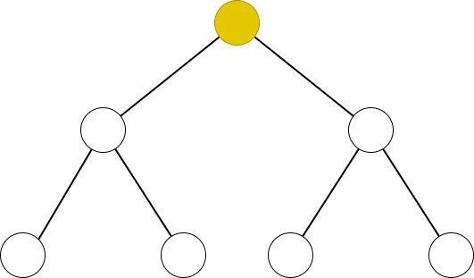
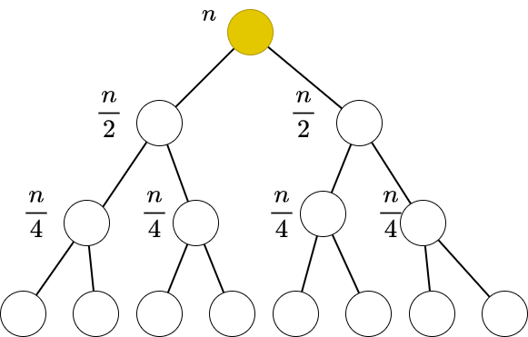

# [树上找到重心然后暴力分治 解决是否存在距离为 k 的点对问题](https://www.luogu.com.cn/problem/P3806)



从任意一个点开始，先去找这棵树的重心，找到后，从重心开始递归处理所有的子树

在递归处理所有子树时，寻找所有子树的重心，继续以子树的重心为根节点递归下去

对于每一颗子树，都可以暴力处理，因为递归的深度只有 $\log(n)$ 层，而每一层的数据量之和都是 $n$，所以总的复杂度是 $n\log(n)$

可以将树想象成一棵平衡树来思考，因为平衡树的任意一个节点都是其子树的重心



所以可以在每个递归树的节点去统计所有子树的信息，时间复杂度总共加起来也才 $n\log(n)$

```c++
#include <bits/stdc++.h>

const long long N = 2e4 + 100;
const long long M = 1e7 + 100;
const long long inf = 1e9;
long long n, m;
long long g[N], e[N], ne[N], w[N], ant;
long long query[N], ans[N];

void add(long long x, long long y, long long z)
{
    ant ++;
    e[ant] = y;
    w[ant] = z;
    ne[ant] = g[x];
    g[x] = ant;
}

long long rt;
long long mx;
long long tree_size; // 子树的大小
long long size[N];
std::queue<long long> qu;
std::vector<long long> path;
bool has[M];
long long vis[N];

// 获取子树的重心，暴力遍历一遍子树的所有节点
void get_root(long long u, long long v)
{
    size[u] = 1;
    long long t = 0;
    for (long long i = g[u]; i; i = ne[i])
    {
        if (e[i] == v || vis[e[i]]) continue;
        get_root(e[i], u);
        size[u] += size[e[i]];
        t = std::max(t, size[e[i]]);
    }
    t = std::max(t, tree_size - size[u]);
    if (t < mx)
    {
        mx = t; rt = u;
    }
}

// 获取以 u 为根且从 u 出发的所有路径长度，暴力遍历一遍子树的所有节点
void get_path(long long u, long long v, long long d)
{
    if (d >= M) return;
    path.push_back(d);
    for (long long i = g[u]; i; i = ne[i])
    {
        if (e[i] == v || vis[e[i]]) continue;
        get_path(e[i], u, d + w[i]);
    }
}

// 树上分治处理
void dv_solve(long long u, long long v)
{
    vis[u] = 1; // 重心处切断，切断出子树
    for (long long i = g[u]; i; i = ne[i])
    {
        if (e[i] == v || vis[e[i]]) continue;
        rt = 0; mx = inf; tree_size = size[e[i]];
        get_root(e[i], u); // 获取子树的重心
        long long center = rt; 
        dv_solve(center, u); // 从子树的重心处递归处理所有子树
    }
    
    for (long long i = g[u]; i; i = ne[i])
    {
        if (e[i] == v || vis[e[i]]) continue;
        path.clear(); // 获取子树的所有路径长度
        get_path(e[i], u, w[i]);
        for (auto d : path)
        {
            for (long long i = 1; i <= m; i ++)
            {// 判断距离为 k 的点对是否存在
                long long t = query[i] - d;
                if (d == query[i]) ans[i] = 1;
                if (t >= 0 && has[t]) ans[i] = 1;
            }
        }
        for (auto d : path)
        { // 添加路径进去，放入队列中方便后面删除。
            has[d] = 1;
            qu.push(d);
        }
    }
    
    while (qu.size())
    {
        has[qu.front()] = 0;
        qu.pop();
    }
    
    vis[u] = 0;
}

void solve()
{
    std::cin >> n >> m;
    for (long long i = 1; i < n; i ++)
    {
        long long x, y, z; std::cin >> x >> y >> z;
        add(x, y, z); add(y, x, z);
    }
    for (long long i = 1; i <= m; i ++) std::cin >> query[i];
    rt = 0; mx = inf; tree_size = n;
    get_root(1, 0);
    long long center = rt;
    dv_solve(center, 0);
    for (long long i = 1; i <= m; i ++)
    {
        if (ans[i]) std::cout << "AYE\n";
        else std::cout << "NAY\n";
    }
}

int main()
{
    std::ios::sync_with_stdio(0);
    std::cin.tie(0); std::cout.tie(0);
    
    solve();
    return 0;
}
```
