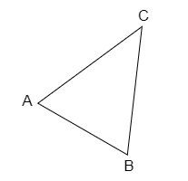

# [计算几何知识点]()

已知两点 $A(x_1, y_1)$ 和 $B(x_2, y_2)$

则 $A$ 到 $B$ 的向量为：$\vec{a} = (x_2 - x_1, y_2 - y_1)$

---

已知向量 $\vec{a} = (x_1, y_1)$，$\vec{b} = (x_2, y_2)$

则点积 $\vec{a} \cdot \vec{b} = (x_1 * x_2) + (y_1 * y_2)$ 同项相乘再相加

叉积 $\vec{a} \times \vec{b} = (x_1 * y_2) - (y_1 * x_2)$ 交叉相乘再相减

---

判断两向量的夹角类型：

- 若 $\vec{a} \cdot \vec{b} < 0$ 是钝角
- 若 $\vec{a} \cdot \vec{b} > 0$ 是锐角
- 若 $\vec{a} \cdot \vec{b} = 0$ 是直角

---

计算三点围成的三角形面积

$S = |\vec{AC} \times \vec{AB}| \div 2$

---

- 若两向量共线，则 $\vec{a} \times \vec{b} = 0$
- 若两向量垂直，则 $\vec{a} \cdot \vec{b} = 0$

---

向量 $\vec{a} = (x, y)$ 逆时针旋转 $\theta$：$(x\cos\theta - y\sin\theta, x\sin\theta + y \cos\theta)$

---

若已知直线为：$Ax + By + C = 0$

---

已知两点 $(x_1, y_1)$、$(x_2, y_2)$ 求直线方程：

- $A = y_1 - y_2$
- $B = x_2 - x_1$
- $C = x_1 * y_2 - x_2 * y_1$

---

判断点是否在直线上，可以带入直线方程也可以在直线上寻找两点用叉积判断是否平行

---

判断点 $C$ 是否在线段 $AB$ 上：

- 先用叉积判断是否共线 (随便选取两条线作叉积)
- 然后用点积判断角 $C$ 是否为钝角（180°）

---

求点 $C$ 到 $AB$ 的距离：

- 先用叉积求出 $ABC$ 的面积
- 然后扩大两倍后除以边 $AB$ 的长度

---

求点 $C$ 到 $AB$ 上的投影点 $p$：

- 令 $k = (C - A) \cdot (B - A) \div |B - A| \div |B - A|$
- 投影点 $\vec{p} = \vec{A} + k(\vec{B} - \vec{A})$

---

求点 $C$ 关于直线 $AB$ 的对称点 $C^{'}$：

先求 $C$ 在 $AB$ 上的投影点 $P$，则有向量相等：

$C^{'} - P = P - C$

所以 $C ^ {'} = 2 * P - C$

---

求点 $C$ 到线段 $AB$ 的距离：

先求出 $C$ 到直线 $AB$ 的投影点 $P$，然后判断 $P$ 是否在线段 $AB$ 上

如果在，就求出 $PC$ 的距离；

否则就求出 $AC$、$CB$ 的距离，取最小值

---

判断两直线的关系：

先判断两直线是否平行（向量叉积）

如果平行，判断一条直线上的某个点是否在另外一个直线上

---

